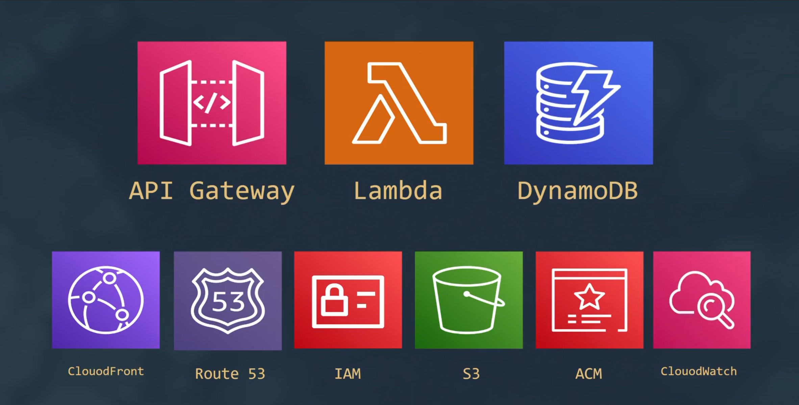

# 🎟️ Serverless Raffle Application

## Overview
This is a serverless raffle (drawing) application built on AWS.  
Users can **apply** to the raffle, the system can **count** applicants, and an admin can **draw** 3 random winners.  
The backend is implemented using AWS Lambda functions, DynamoDB stores applicants, and API Gateway exposes the functions. The frontend is hosted on S3 and distributed through CloudFront.

---

## Features
- `apply` — add an applicant (email, name, phone)
- `count` — return the total number of applicants
- `draw` — randomly select 3 winners and mark them as winners in the DB
- Frontend hosting on S3 + CloudFront
- Optional custom domain with Route 53 + ACM
- Logs and monitoring via CloudWatch

---

## DynamoDB Table
**Table name:** `devops_raffle`  
**Partition key:** `email` (string)

**Item structure (example):**
```json
{
  "email": "user@example.com",
  "name": "John Doe",
  "phone": "+201234567890",
  "won": "no"
}
```

## AWS Services (icons)
<div style="display:flex; flex-wrap:wrap; gap:16px; align-items:center;">
  <div style="text-align:center;">
    
  </div>
</div>

---


## API Endpoints (example)
> These are example endpoints. Replace with your deployed API Gateway URLs.

- `POST /apply` — body: `{ "email": "...", "name": "...", "phone": "..." }`
- `GET /count` — returns `{ "count": 123 }`
- `POST /draw` — triggers draw and returns winners list

---

## Lambda Function Behavior

### apply
- Validates input (email, name, phone)  
- Writes a new item to DynamoDB with `won: "no"`

### count
- Reads/queries the table and returns the number of items

### draw
- Fetches all applicants (or a paginated set)  
- Randomly selects 3 unique winners  
- Updates the `won` attribute to `"yes"` for each winner  
- Returns the winners
---

## Frontend
- Simple static HTML pages (e.g., `apply.html`, `draw.html`) that call the API endpoints
- Host the static files in an S3 bucket configured for website hosting
- Use CloudFront for CDN + TLS

---

## Deployment Steps (high level)
1. Create DynamoDB table `devops_raffle`
2. Create Lambda functions (`apply`, `count`, `draw`) and grant DynamoDB permissions
3. Create REST API in API Gateway and integrate endpoints with Lambda
4. Configure ACM certificate for your domain (if using a custom domain)
5. Create CloudFront distribution for the S3-hosted frontend
6. Upload frontend files to S3 and test the flow
7. Configure Route 53 records to point domain to CloudFront (optional)
8. Monitor logs in CloudWatch

---

## Local Project Layout (suggested)
```
/
├── lambda/
│   ├── apply.js
│   ├── count.js
│   └── draw.js
├── frontend/
│   ├── apply.html
│   └── draw.html
└── README.md
```

---

## Security & Best Practices
- Use least-privilege IAM roles for Lambda functions
- Enable encryption at rest for DynamoDB (defaults to AWS-managed keys)
- Validate and sanitize user input to prevent injection issues

---

## Monitoring
- Stream Lambda logs to CloudWatch
- Set CloudWatch alarms for errors or throttles

